# ScreenLess

**Phone down, friendship up.**

A native Android product that turns putting the phone away into a **shared ritual** for small friend groups — not a solo lock-out, not a shame scoreboard.

Friends open timed *screenless windows* (study, walks, hangouts, deep work). While a window is live, ScreenLess notices distracting apps **with consent**, then fans out a warm signal: *“Karan peeked at socials.”* Peeking is allowed. Leaving is the only real drop. Streaks grow like a garden. Reflections are two lines, not a journal product.

This repository is a full monorepo: **Kotlin + Jetpack Compose** client, **TypeScript API**, **jobs worker**, **ops admin**, and a high-fidelity product showcase.

[](apps/android)
[](services/api)
[](services/api/src/streakEngine.test.ts)
[](LICENSE)

<p align="center">
  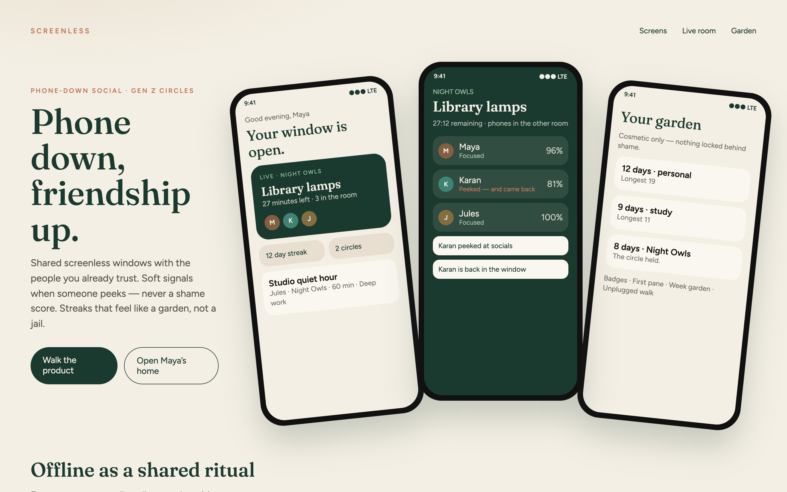
</p>

<p align="center"><em>Product preview · Night Owls circle · “Library lamps” is live.</em></p>

---

## Why this exists

Gen Z already lives in group chats. Focus apps still treat attention as a **private vice** to be punished: rigid locks, red failure states, no friends in the room.

ScreenLess takes the opposite bet:

| Typical focus app | ScreenLess |
|---|---|
| Solo | Small private circles |
| Punitive lock | Opt-in window with your own “discouraged” apps |
| Minute-by-minute logs | One friendly signal |
| Streak as a jail | Streak as a garden — cosmetics only |
| Public feed | **No public feed.** Invite codes only |

The tagline is the architecture: **phone down, friendship up.** Offline time is social, or it does not stick.

---

## Product tour

### Home — a window, already open

Maya’s evening. Night Owls is live. The next sitting is Jules’s studio hour. Streaks and circles are chips, not dashboards.

<p align="center">
  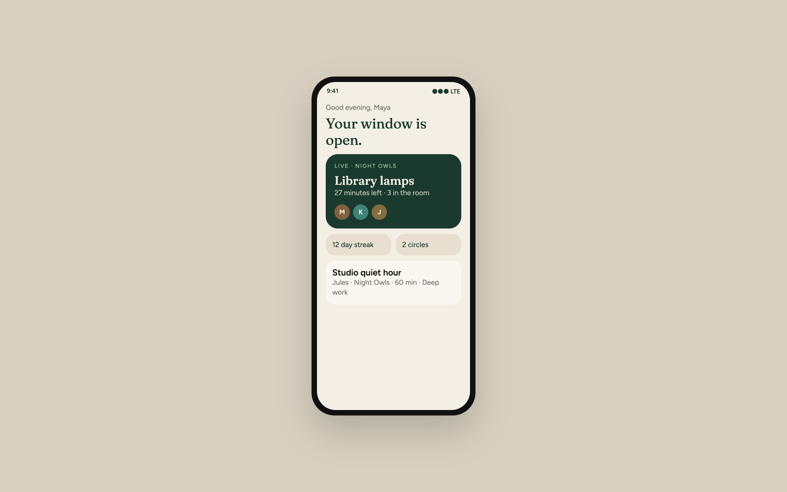
</p>

### Live room — presence, not surveillance

Forest night. People first. Percentages second. Karan peeked, then came back. The copy is dry on purpose. Nobody is ranked “worst.”

<p align="center">
  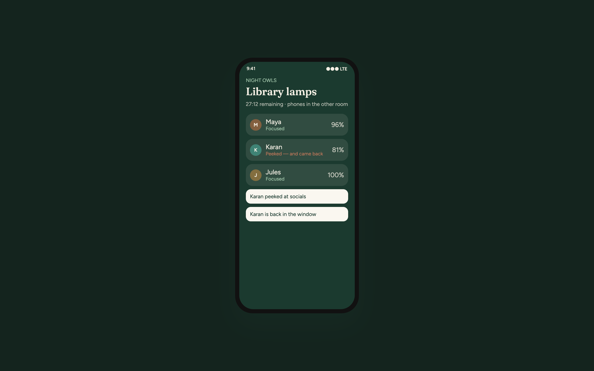
</p>

### Open a window · garden · two-line reflection

A window is a promise with a clock. Contexts are study, walk, social, deep work, self-care. After it closes: one prompt, 400 characters, then it becomes a postcard in the log.

<p align="center">
  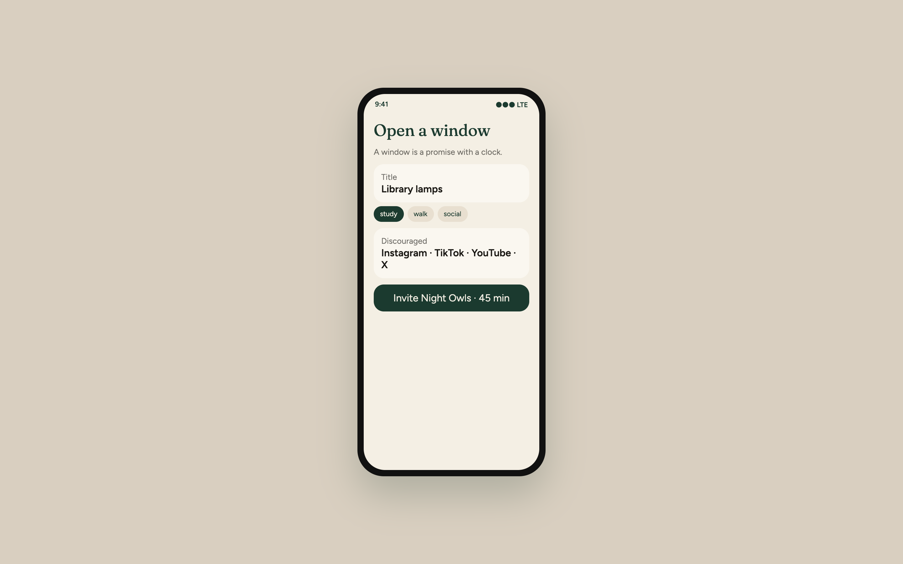
  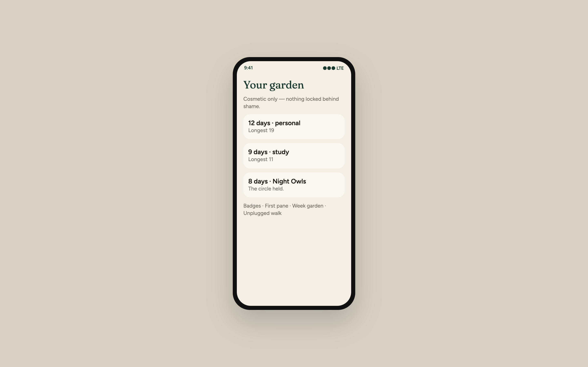
  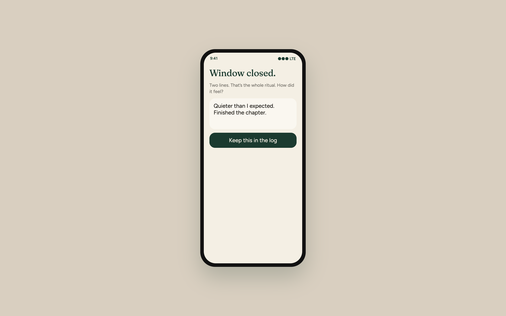
</p>

### Circles and consent

Private groups, invite codes (`OWL42K`, `WALK9M`). Tracking is **category-level** and **window-scoped**. Messaging is off by default — a WhatsApp ping during study is often coordination, not doomscrolling.

<p align="center">
  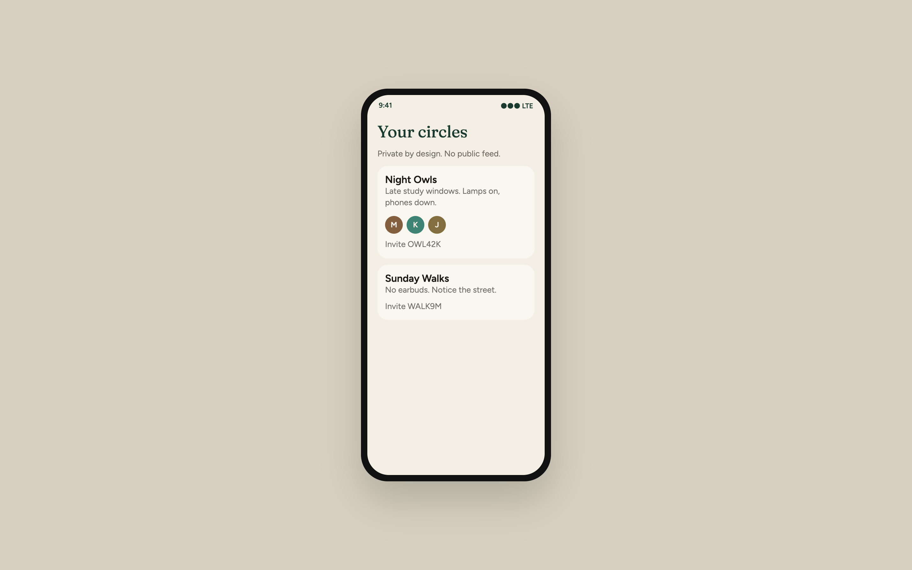
  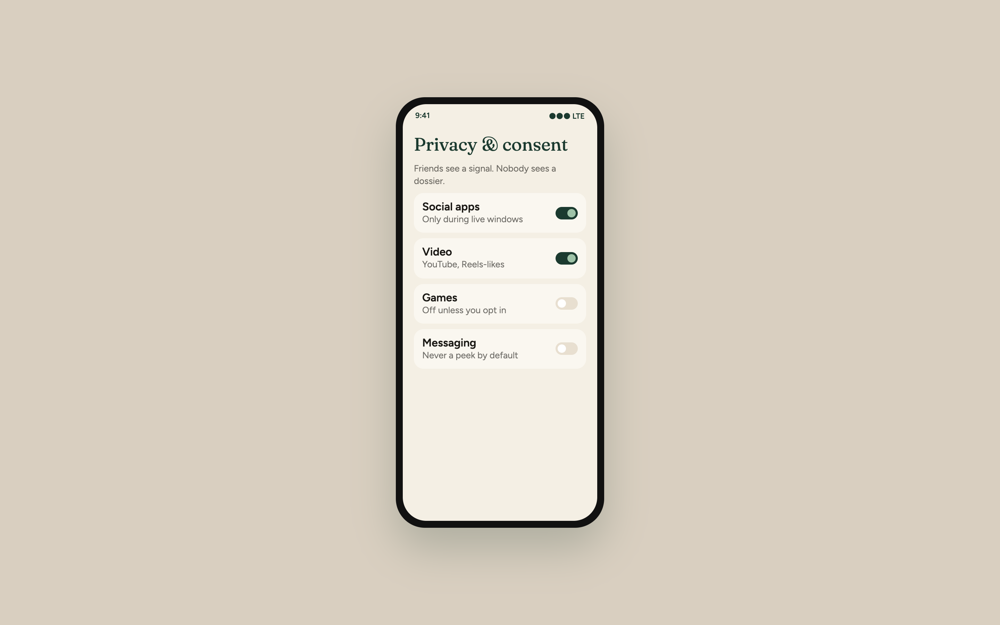
</p>

Full screen set: [`docs/screenshots/09-gallery.png`](docs/screenshots/09-gallery.png)

---

## Architecture

The interesting constraint: **a killed phone must not freeze the room**, and **friends must never receive a dossier**.

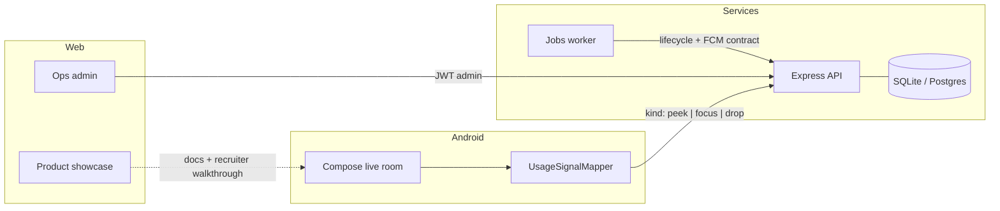

| Module | Stack | Owns |
|---|---|---|
| [`apps/android`](apps/android) | Kotlin, Compose, Hilt, Retrofit, Room, WorkManager | UI, consent, on-device usage collapse |
| [`services/api`](services/api) | Node 22, Express, Prisma, Zod, JWT | Auth, circles, windows, signals, streaks |
| [`services/jobs`](services/jobs) | Node worker | `SCHEDULED → LIVE → ENDED`, reminder fan-out |
| [`web/admin-panel`](web/admin-panel) | React + Vite, forest-night ops UI | Pulse, reports, flags, prompts |
| [`web/showcase`](web/showcase) | React + Vite | Pixel-faithful phone UI for this README |

**Privacy boundary** (the feature, not a footer):

```
UsageEvents  →  package → category  →  {focus, peek, drop}  →  POST /v1/signals
device only     never uploaded         one kind                  "Karan peeked at socials"
```

Streak math is a **pure function** with tests. Peeking does not fail a window. Dropping does. Read [`services/api/src/streakEngine.ts`](services/api/src/streakEngine.ts) before anything else if you are interviewing me.

---

## Monorepo

```text
ScreenLess/
├── apps/android/            Native client (Compose)
├── services/api/            REST + Prisma + streak engine
├── services/jobs/           Window lifecycle worker
├── web/admin-panel/         Operator console
├── web/showcase/            Product preview (these screenshots)
├── docs/                    Product, architecture, API, privacy, design
└── docker-compose.yml       Optional Postgres-backed stack
```

---

## Quick start

You need **Node.js 20+**. Android Studio only if you want the APK.

```bash
# API + seed (SQLite, zero Docker)
cd services/api
cp .env.example .env
npm install
npx prisma generate
npx prisma db push
npm run seed
npm run dev                 # http://localhost:4000/health

# in another terminal — ops
cd web/admin-panel && npm install && npm run dev     # http://localhost:3000

# in another terminal — this README's phones
cd web/showcase && npm install && npm run dev        # http://localhost:5173
```

Seeded identities (password for all: `screenless`):

| Who | Email | Why |
|---|---|---|
| Operator | `admin@screenless.app` | Admin panel |
| Maya | `maya@screenless.app` | Night Owls owner, 12-day garden |
| Karan | `karan@screenless.app` | The peek-and-return |
| Jules | `jules@screenless.app` | 21-day streak |
| Nico | `nico@screenless.app` | Sunday Walks |

Invite codes: **OWL42K** · **WALK9M**

```bash
cd services/api && npm test     # 10 tests, streak constitution
```

Android: open [`apps/android`](apps/android) in Android Studio. Emulator host is `http://10.0.2.2:4000/v1/`.

Full runbook: [`docs/SETUP.md`](docs/SETUP.md)

---

## Ops admin

Night-forest console. Not a growth cockpit. The copy is the policy: *soft product, firm safety.*

<p align="center">
  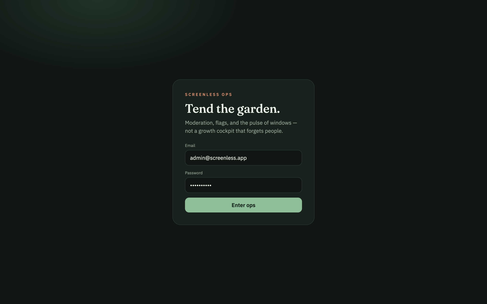
  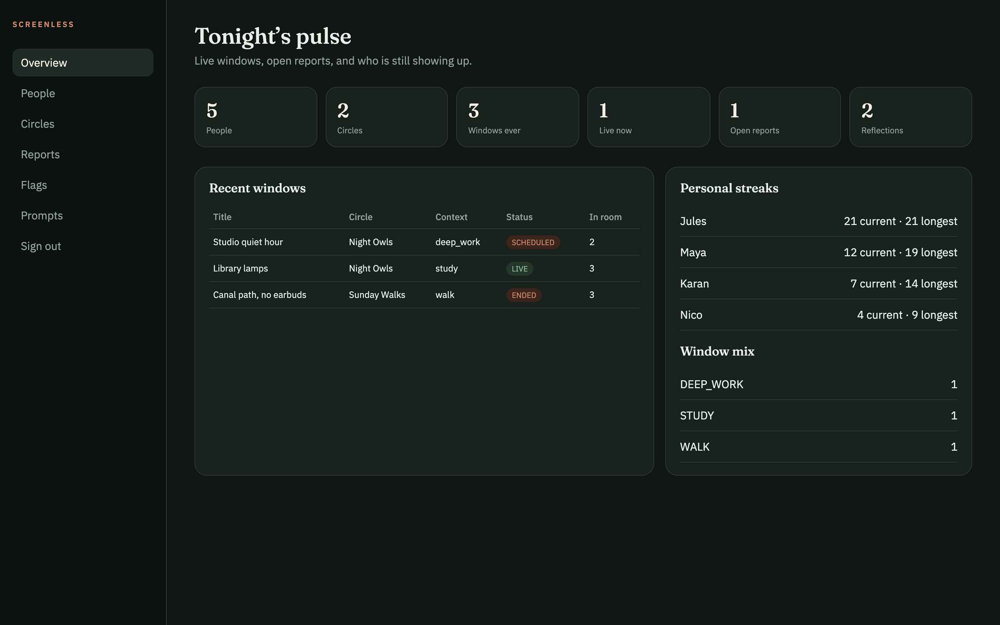
</p>

<p align="center">
  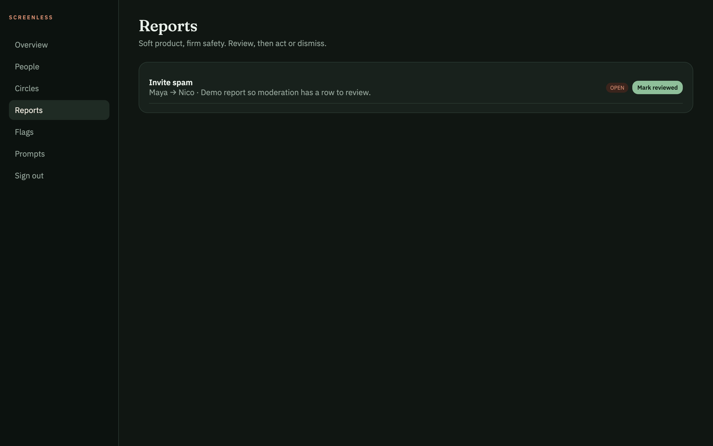
  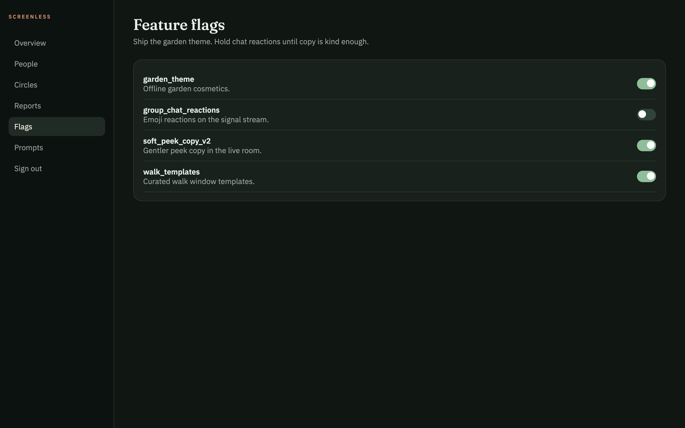
</p>

Flags are rows, not deploys. Chat reactions stay off until the tone is kind enough. That is a product decision encoded as `group_chat_reactions: false`.

---

## API surface (abridged)

```http
POST /v1/auth/login
GET  /v1/groups
POST /v1/windows
POST /v1/signals          { "kind": "peek", "appCategory": "socials" }
GET  /v1/streaks
POST /v1/reflections
PUT  /v1/privacy/tracking
DELETE /v1/privacy/me
GET  /v1/admin/overview
```

Errors return human copy, not stack traces: `{ "error": "That invite doesn’t open a circle." }`

Complete contract: [`docs/API.md`](docs/API.md)

---

## Design language

Paper lamp, not productivity SaaS. Cream, forest, clay. Fraunces for titles, Figtree / IBM Plex for UI. The consumer app is **day paper**. Ops is **night forest**. Same tokens, inverted, so nobody confuses the two.

Voice: a friend who hates hustle influencers.

- Yes: “Leave softly.”
- No: “Abandon challenge.”
- Yes: “Your garden.”
- No: “Gamified engagement loop.”

[`docs/DESIGN.md`](docs/DESIGN.md)

---

## Documentation

| Doc | What you get |
|---|---|
| [`docs/product-screenless.md`](docs/product-screenless.md) | Original product brief — the source of truth |
| [`docs/ARCHITECTURE.md`](docs/ARCHITECTURE.md) | Modules, data model, privacy boundary, jobs contract |
| [`docs/API.md`](docs/API.md) | Every route, demo identities, signal copy table |
| [`docs/PRIVACY.md`](docs/PRIVACY.md) | Consent, retention, threat model (honest) |
| [`docs/DESIGN.md`](docs/DESIGN.md) | Color, type, motion, copy rules |
| [`docs/SETUP.md`](docs/SETUP.md) | Local, Docker, emulator, troubleshooting |
| [`CONTRIBUTING.md`](CONTRIBUTING.md) | What not to “helpfully” add |
| [`SECURITY.md`](SECURITY.md) | How to report a hole |

---

## Decisions worth arguing about

These are the ones I would defend in a design review:

1. **Signals, not logs.** If the API stored Instagram dwell time, the product would be a snitch. Minimization is the threat model.
2. **Jobs own time.** Window end is not “last phone still in the room.” A dead battery cannot hold a circle hostage.
3. **Peek ≠ fail.** `focusedPct >= 70` and not `DROPPED`. Soft accountability dies the moment you punish a glance.
4. **No public feed.** Growth-hacking a doomscroll product to fight doomscrolling is a joke I refused to ship.
5. **SQLite default.** A recruiter should clone, seed, and click. Postgres is a compose swap, not a personality.

Intentionally not faked: Play Console listing, FCM credentials, OEM-specific Accessibility fallbacks, Redis queues. Comments in `services/jobs` describe the production contract instead of pretending Redis is running.

---

## License

MIT. Use it, fork it, or steal the streak tests.

---

<p align="center"><strong>SCREENLESS</strong><br/>Phone down, friendship up.</p>
